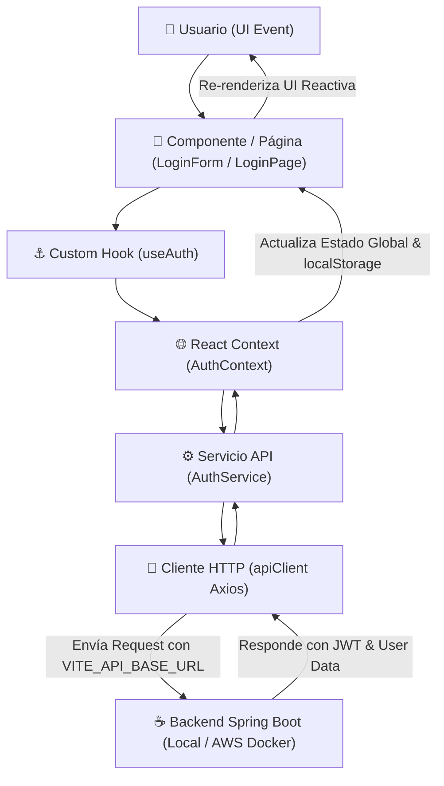

# Documentación Arquitectónica de la Infraestructura Frontend

## 1. Visión General de la Infraestructura

El frontend de **DiagramConect** está construido con **React 19**, **Vite** y **TypeScript**, utilizando **Tailwind CSS v4** para el estilizado y **Axios** para la comunicación HTTP. 

La arquitectura sigue el principio de **Separación Estricta de Responsabilidades (Clean Architecture)**. Cada directorio tiene un propósito único y bien delimitado, evitando el acoplamiento entre la lógica de interfaz (UI), el manejo de estado global, la lógica de negocio y los servicios de comunicación con el backend.

```
frontend/
├── .env                  # Variables de entorno para desarrollo local
├── .env.example          # Plantilla de variables de entorno para producción/Docker
├── vite.config.ts        # Configuración de Vite y plugins
└── src/
    ├── config/           # Configuración de cliente API y entorno
    ├── constants/        # Constantes globales del sistema
    ├── types/            # Interfaces y tipos de TypeScript
    ├── services/         # Consumo de APIs del Backend (Spring Boot)
    ├── context/          # Manejo de Estado Global (React Context)
    ├── hooks/            # Custom Hooks reutilizables
    ├── components/       # Componentes UI organizados por dominio
    │   ├── common/       # Átomos y componentes de UI reutilizables
    │   ├── auth/         # Componentes específicos de autenticación
    │   └── landing/      # Componentes de la Landing Page
    ├── pages/            # Vistas completas del sistema (Rutas)
    └── routes/           # Definición de rutas y navegación
```

---

## 2. Detalle de Directorios y su Contenido

### 📁 `src/config/`
Contiene los módulos de configuración central de la aplicación.
- **`env.ts`**: Lectura y exportación segura de las variables de entorno (`import.meta.env`). Asegura que no existan URLs hardcodeadas.
- **`api.ts`**: Instancia central de **Axios** (`apiClient`) configurada con la `baseURL` del backend, tiempos de espera (timeout) e interceptores para inyectar automáticamente el encabezado `Authorization: Bearer <token>` en cada petición.

### 📁 `src/constants/`
Almacena constantes inmutables del sistema.
- **`routes.ts`**: Objeto con todas las rutas de la aplicación (`HOME`, `LOGIN`, `REGISTER`, `DASHBOARD`), evitando strings literales en los componentes.

### 📁 `src/types/`
Contiene exclusivamente las definiciones de tipos e interfaces TypeScript.
- **`auth.types.ts`**: Define los contratos de datos para `User`, `LoginRequest`, `RegisterRequest`, `AuthResponse` y `AuthState`.

### 📁 `src/services/`
Capa de integración encargada de comunicarse con las API REST del Backend Spring Boot.
- No almacena estado de React.
- **`auth.service.ts`**: Métodos puros asíncronos (`login`, `register`) que utilizan `apiClient` para enviar y recibir datos del servidor.

### 📁 `src/context/`
Almacena los proveedores de **Estado Global** de la aplicación mediante React Context.
- **`AuthContext.tsx`**: Administra el estado global de autenticación (`user`, `token`, `isAuthenticated`, `isLoading`), la persistencia en `localStorage` y las acciones globales (`login`, `register`, `logout`).

### 📁 `src/hooks/`
Custom Hooks de React que abstraen y reutilizan lógica compleja.
- **`useAuth.ts`**: Hook para consumir el `AuthContext` de forma limpia y segura desde cualquier componente de la aplicación.

### 📁 `src/components/`
Componentes visuales organizados por dominio funcional:
- **`common/`**: Componentes de UI genéricos (átomos) reutilizables en cualquier parte del sistema.
  - `Button.tsx`: Botón personalizable con variantes (`primary`, `secondary`, `outline`, `danger`).
  - `Input.tsx`: Campo de texto con etiquetas de error y estilizado uniforme.
  - `Navbar.tsx`: Barra de navegación superior reactiva al estado del usuario.
  - `Footer.tsx`: Pie de página global.
- **`auth/`**: Formularios específicos del módulo de autenticación.
  - `LoginForm.tsx`: Formulario de inicio de sesión.
  - `RegisterForm.tsx`: Formulario de registro de usuario.
- **`landing/`**: Componentes visuales de la Landing Page promocional.
  - `HeroSection.tsx`: Presentación principal con llamados a la acción (CTA).
  - `FeaturesSection.tsx`: Grilla con las características principales de DiagramConect.

### 📁 `src/pages/`
Componentes contenedores que representan páginas/vistas completas.
- **`LandingPage.tsx`**: Ensambla la vista principal (`Navbar`, `HeroSection`, `FeaturesSection`, `Footer`).
- **`LoginPage.tsx`**: Contenedor centrado para el `LoginForm`.
- **`RegisterPage.tsx`**: Contenedor centrado para el `RegisterForm`.

### 📁 `src/routes/`
Gestión de rutas de la aplicación.
- **`AppRoutes.tsx`**: Mapea las rutas configuradas en `ROUTES` a sus respectivas `Pages` usando React Router.

---

## 3. Flujo de Comunicación e Interacción entre Capas

La aplicación sigue un **flujo de datos unidireccional y desacoplado**. Los componentes visuales nunca se comunican directamente con el Backend; en su lugar, delegan la lógica a través del siguiente flujo de capas:



### Paso a Paso de una Interacción (Ejemplo: Inicio de Sesión)

1. **Acción del Usuario (Capa UI):**
   El usuario completa sus credenciales en `LoginForm.tsx` y presiona el botón "Entrar".

2. **Delegación al Hook:**
   El componente llama a la función `login({ email, password })` provista por el hook `useAuth()`.

3. **Ejecución en el Contexto (Manejo de Estado):**
   El `AuthContext.tsx` recibe la llamada, cambia su estado interno a `isLoading = true` y delega la llamada de red al servicio.

4. **Invocación del Servicio (Capa de Infraestructura HTTP):**
   `AuthService.login()` realiza un `apiClient.post('/auth/login', credentials)`.

5. **Resolución en `apiClient` (Axios):**
   - Obtiene la URL base desde `ENV.API_BASE_URL` (`http://localhost:8080/api` o IP de producción en AWS).
   - Envía el payload JSON al controlador Spring Boot (`AuthController.java`).

6. **Procesamiento de Respuesta:**
   - El Backend valida credenciales y retorna un `AuthResponse` con el token JWT.
   - `AuthContext` almacena el token y los datos del usuario en `localStorage` para garantizar la persistencia de sesión al recargar la página.
   - El estado global `isAuthenticated` cambia a `true`.

7. **Actualización Automática de la UI:**
   React re-renderiza la interfaz. La `Navbar` cambia automáticamente para mostrar el nombre del usuario y el botón de "Salir", y el usuario es redirigido al destino correspondiente.
